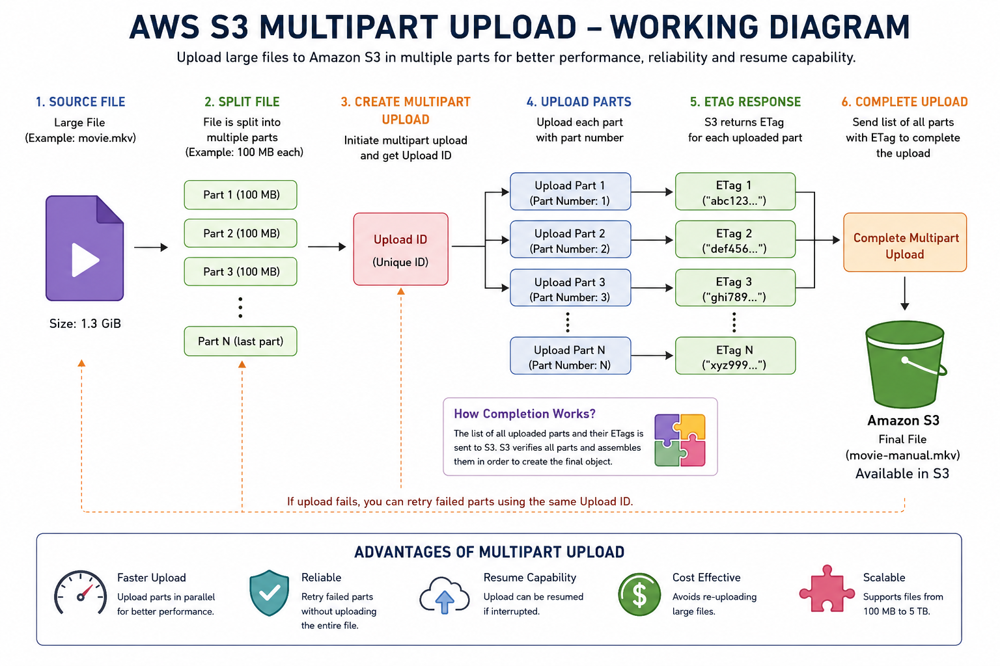

# AWS S3 Multipart Upload with AWS CLI and PowerShell



## Project Overview

This project demonstrates a manual Amazon S3 Multipart Upload workflow using AWS CLI and PowerShell.

A large file is split into smaller parts, each part is uploaded to Amazon S3, the ETag returned for each part is collected, and the multipart upload is completed so S3 creates one final object.

### Demo

- Source file: `movie.mkv`
- Example source size: 1.3 GiB
- Part size: 100 MB
- S3 bucket: `my-vikas-bucket-multi`
- Final object: `movie-manual.mkv`

## Architecture / Workflow

```text
Large File
    |
    v
PowerShell Split Script
    |
    +--> Part 1
    +--> Part 2
    +--> Part 3
    +--> ...
    |
    v
CreateMultipartUpload
    |
    v
UploadId
    |
    v
UploadPart (each part)
    |
    v
ETag for each part
    |
    v
parts.json
    |
    v
CompleteMultipartUpload
    |
    v
Amazon S3
    |
    v
One final object
```

## Technologies

- Amazon S3
- AWS CLI
- PowerShell
- S3 Multipart Upload API
- JSON
- Windows

## Project Structure

```text
aws-s3-multipart-upload/
|
├── README.md
├── .gitignore
├── LICENSE
|
├── scripts/
|   ├── split-movie.ps1
|   └── upload-multipart.ps1
|
├── config/
|   └── example-config.ps1
|
├── docs/
|   ├── aws-s3-multipart-upload-working-diagram.png
|   └── workflow.md
|
└── examples/
    └── fileparts-example.json
```

## Prerequisites

1. An AWS account with an S3 bucket.
2. AWS CLI installed.
3. AWS credentials configured securely.
4. PowerShell.
5. A large test file.

Check AWS CLI:

```powershell
aws --version
```

Check the active AWS identity:

```powershell
aws sts get-caller-identity
```

Configure credentials using your normal secure AWS CLI setup:

```powershell
aws configure
```

>.

## Step 1 - Split the File

Update these values in `scripts/split-movie.ps1` if required:

```powershell
$FilePath = "D:\movie\movie.mkv"
$OutputFolder = "D:\movie\parts"
$PartSize = 100MB
```

Run:

```powershell
cd D:\movie
Set-ExecutionPolicy -Scope Process -ExecutionPolicy Bypass
.\split-movie.ps1
```

The script creates:

```text
parts/
├── part-001
├── part-002
├── part-003
└── ...
```

## Step 2 - Create the Multipart Upload

The low-level S3 API command is:

```powershell
aws s3api create-multipart-upload `
  --bucket my-vikas-bucket-multi `
  --key movie-manual.mkv
```

S3 returns an `UploadId`.

The included `upload-multipart.ps1` captures this automatically, so you do not need to hard-code the UploadId.

## Step 3 - Upload Parts

The API operation is:

```powershell
aws s3api upload-part
```

Conceptually:

```powershell
aws s3api upload-part `
  --bucket my-vikas-bucket-multi `
  --key movie-manual.mkv `
  --part-number 1 `
  --body "D:\movie\parts\part-001" `
  --upload-id "UPLOAD_ID"
```

S3 returns an ETag for each successfully uploaded part.

The included PowerShell script loops through all parts and collects these ETags automatically.

## Step 4 - Verify Parts

You can list uploaded parts with:

```powershell
aws s3api list-parts `
  --bucket my-vikas-bucket-multi `
  --key movie-manual.mkv `
  --upload-id "UPLOAD_ID"
```

## Step 5 - Complete the Upload

S3 needs the part numbers and ETags to assemble the final object.

The script automatically creates `parts.json` and calls:

```powershell
aws s3api complete-multipart-upload `
  --bucket my-vikas-bucket-multi `
  --key movie-manual.mkv `
  --upload-id "UPLOAD_ID" `
  --multipart-upload file://parts.json
```

After successful completion, S3 exposes one final object:

```text
s3://my-vikas-bucket-multi/movie-manual.mkv
```

## Run the Complete Automated Upload

After the parts have been created:

```powershell
cd D:\movie
Set-ExecutionPolicy -Scope Process -ExecutionPolicy Bypass
.\upload-multipart.ps1
```

The script automatically:

1. Creates the multipart upload.
2. Gets the UploadId.
3. Finds all `part-*` files.
4. Uploads every part.
5. Collects ETags.
6. Creates `parts.json`.
7. Completes the multipart upload.
8. Prints the final S3 object path.

## Verify the Final Object

```powershell
aws s3 ls s3://my-vikas-bucket-multi/
```

## Abort an Incomplete Upload

If an upload fails before completion, use:

```powershell
aws s3api abort-multipart-upload `
  --bucket my-vikas-bucket-multi `
  --key movie-manual.mkv `
  --upload-id "UPLOAD_ID"
```

List incomplete multipart uploads:

```powershell
aws s3api list-multipart-uploads `
  --bucket my-vikas-bucket-multi
```

## What Should NOT Be Committed

Do not commit:

- Large movie/video files
- Generated multipart parts
- Real `parts.json` containing actual upload ETags
- AWS access keys
- AWS secret keys
- `.env` files
- Private credentials

The repository contains scripts and documentation, not the large media file.

## Key AWS Concepts Learned

- Multipart Upload lifecycle
- UploadId
- PartNumber
- ETag
- CreateMultipartUpload
- UploadPart
- ListParts
- CompleteMultipartUpload
- AbortMultipartUpload
- PowerShell automation
- AWS CLI

## AWS Reference

- AWS re:Post: https://repost.aws/knowledge-center/s3-multipart-upload-cli
- S3 Multipart Upload overview: https://docs.aws.amazon.com/AmazonS3/latest/userguide/mpuoverview.html

## Author

**Vikas Jagtap**

AWS / DevOps learning project focused on practical cloud automation.
